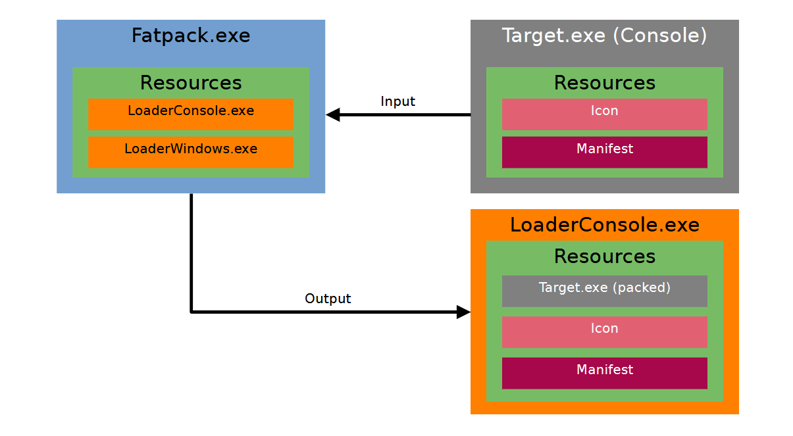
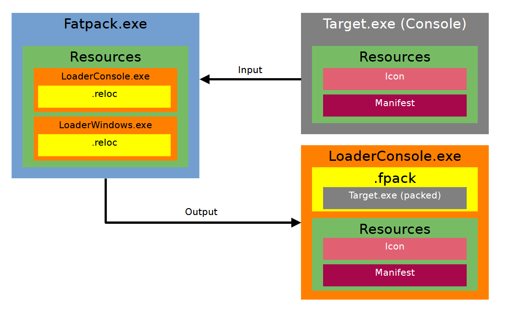

# Fatpack  

A Windows executable (PE) packer (x64) with LZMA compression and with full TLS (Thread Local Storage) support.  

Keywords: PE packer, PE loader, executable packer, manual mapping, manual mapper, portable executable, LZMA, UPX, EXE

## Motivation

A practical application of my PE loader (manual mapper): https://github.com/Fatmike-GH/PELoader  

## Usage

``Fatpack.exe inputfile.exe outputfile.exe [OPTIONS]``  
``[OPTIONS]``  
``-r, --resource : Packs inputfile.exe as resource (DEFAULT)``  
``-s, --section  : Packs inputfile.exe as section (EXPERIMENTAL)``

## Features

### Functional Features  

- Support for native Console- and Windows executables (x64 only, no .NET support)  
- LZMA compression  
- Full TLS (Thread Local Storage) support  
  - Therefore supports Rust- and Delphi exectuables for example  
- No CRT usage in Fatpack.exe and Stubs (WinAPI only) and therefore no C/C++ redistributables are required  
- Icon extraction
- Packing options
  - Resource Packing : The packed target is embedded as a resource in the loader stub, including rebasing if necessary.
  - Section Packing : The packed target is appended as section within the loader stub.

### Technical Features  

- Relocations
- Imports
- Delay Imports
- Exception Handlers
- Proper Memory Section Protection
- Full TLS (Thread Local Storage) support
  - TLS Callbacks
    - DLL_PROCESS_ATTACH  
    - DLL_THREAD_ATTACH  
    - DLL_THREAD_DETACH  
    - DLL_PROCESS_DETACH  
  - TLS Data
- Manifest extraction (required, if specfic module versions of the target executable are specified)  

## Solution Overview

The solution consists of four projects:  

- ``Fatpack``  
  - The console application ``Fatpack.exe``, which the user employs to pack their target executable.  
  
- Loader stubs  
  - The loader stubs serve as containers for the packed target executable and are responsible for loading and executing it.  
  - ``Loader_Console``  
  - ``Loader_Windows``  
  
- ``ResourceAdder``
  - ``ResourceAdder.exe``, a helper executable that adds the loader stubs to ``Fatpack.exe`` as post-build step, using the scripts ``PostBuildStep_Debug.bat`` and ``PostBuildStep_Release.bat``.

### Loader Stubs  

Both ``Loader_Console`` and ``Loader_Windows`` serve as loader stubs. Upon startup, they retrieve the packed target executable from their embedded resources (``-r`` option), or from ``.fpack`` section (``-s`` option), unpack it in memory, and execute it.  
The loader logic is available at: https://github.com/Fatmike-GH/PELoader  

- ``Loader_Console``: The loader stub for loading console applications.  
- ``Loader_Windows``: The loader stub for loading windows applications.  

### ResourceAdder  

A simple console application used to embed the loader stubs into ``Fatpack.exe`` as post-build step. This integration is handled via the scripts ``PostBuildStep_Debug.bat`` and ``PostBuildStep_Release.bat``.  

>**Note:** Always use **"Rebuild Solution"** after making changes to ensure that the post-build steps execute correctly.  

### Fatpack

The console application (``Fatpack.exe``) is used by the user to package their target executable. Its main responsibilities include:  

- Determining the appropriate loader stub (Loader_Console or Loader_Windows) based on the type of the target executable, loading it from an embedded resource, and saving it to disk. 
- Rebasing the loader stub if the target does not have a relocation table and there is an image base conflict.  
- Extracting the icon from the target executable and embedding it into the selected loader stub.  
- Extracting and embedding the application manifest from the target executable. This step is essential, as the manifest may specify specific module versions required for correct execution.  
- Compressing the target executable using the LZMA algorithm and appending it to the loader stub.  
- Depending on the selected option (``--resource`` or ``--section``), the packed target is appended to the loader stub in different ways:  
  - Option ``--resource``  
    
  The packed target is appended to the loader stub as a resource. It remains in memory, while the unpacked target is mapped to a new memory location (allocated using *VirtualAlloc*) and executed from there.  

  - Option ``--section``  
    
  The loader stub is rebased so that its ``.reloc`` section aligns with the image base of the target executable. The virtual size of the ``.reloc`` section is adjusted to match the image size of the unpacked target, allowing it to fit entirely within this section at runtime after unpacking. As a result, no additional memory allocation is necessary. As a final step, the ``.reloc`` section is renamed to ``.fpack``.
  >This is the preferred option as it requires less memory at runtime. However, it may cause issues with certain targets in specific cases.  
  
## Fatpack vs UPX 5.0.1 

| Target size 	| UPX     	| UPX -9  	| Fatpack 	| Target info                                   	|
|-------------	|---------	|---------	|---------	|-----------------------------------------------	|
| 6744 kb     	| 1735 kb 	| 1669 kb 	| **1608 kb** 	| Embarcadero Delphi(XE3-X4)[Professional]      	|
| 2728 kb     	| 1052 kb 	| **1034 kb** 	| 1035 kb 	| Rust                                          	|
| 611 kb      	| 86 kb   	| 83 kb   	| **80 kb**   	| Microsoft Visual C/C++(19.36.34808)[C++]      	|
| 533 kb      	| 213 kb  	| 210 kb  	| **199 kb**  	| Rust                                          	|
| 448 kb      	| -       	| -       	| **193 kb**  	| Rust                                          	|
| 233 kb      	| 89 kb   	| 89 kb   	| **85 kb**   	| Microsoft Visual C/C++(19.36.34436)[LTCG/C++] 	|
| 32 kb       	| **9 kb**    	| **9 kb**    	| 16 kb   	| Microsoft Visual C/C++(19.29.30139)[LTCG/C]   	|
| 20 kb       	| **11 kb**  	| **11 kb**   	| 18 kb   	| Microsoft Visual C/C++(19.36.34808)[LTCG/C++] 	|
| 15 kb       	| **10 kb**   	| **10 kb**   	| 17 kb   	| Microsoft Visual C/C++(19.36.34808)[LTCG/C++] 	|

Since the loader stubs (``Loader_Console`` and ``Loader_Windows``) are relatively large,approximately 10 KB each, the compression ratio is less favorable when packing very small target executables. However, for larger executables, the results are significantly more efficient, yielding much better overall compression ratios.  

> **Note:** UPX did not support the 448 kb target

## Third Party Software  

### EasyLZMA  

https://github.com/lloyd/easylzma  

### TinyZZZ  

https://github.com/WangXuan95/TinyZZZ  

### Fatmike's PE Loader  

https://github.com/Fatmike-GH/PELoader

